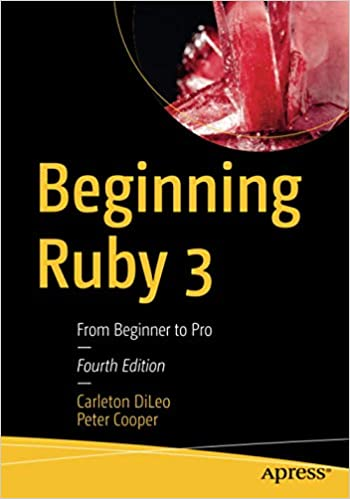

#  Index - Ruby on Rails 

### Labels

:heavy_dollar_sign: Paid :free: Content Free :brazil: pt-BR :us: en :es: es

## Android Apps
* [Anki - flashcards :free:](https://play.google.com/store/apps/details?id=com.ichi2.anki)

* [SoloLearn - courses and community :free:](https://play.google.com/store/apps/details?id=com.sololearn)

* [Pomodoro - timer :free:](https://play.google.com/store/apps/details?id=com.superelement.pomodoro)

* [Ruby Interview Questions :free:](https://play.google.com/store/apps/details?id=eu.ydns.chernish2)

* [Ruby On Rails Interview Questions :free:](https://play.google.com/store/apps/details?id=com.interviewquestions4you.ruby&hl=en&gl=US)

## Chats
#### Telegram

* [Ruby Brazil :brazil:](https://t.me/rubybrasil)

* [Ruby Brazil - Off-topic :brazil:](https://t.me/RubyBrasilOffTopic)

* [GURU-CE :brazil:](https://t.me/guru_ce)

* [ada.rb - Ruby application architecture and design :brazil:](https://t.me/ruby_arch_design_br)

* [Guru-SP :brazil:](https://t.me/gurusp)

* [RubyOnBnu :brazil:](https://t.me/rubyOnBnu)

* [Ruby DF :brazil:](https://t.me/rubydf)

* [Ruby-AL :brazil:](https://t.me/ruby_alagoas)

* [Frevo on Rails :brazil:](https://t.me/frevoonrails)

* [Jampa Ruby :brazil:](https://t.me/jamparuby)

* [GURUPI - THE :brazil:](https://t.me/gurupithe)

* [RubyonRio :brazil:](https://t.me/rubyonrio)

* [Ruby / Rails inside channel :us:](https://t.me/rubyinside)

#### Discord

* [Ruby on Rails :us:](https://discord.gg/cHWTb5ng)

* [Aprende Ruby on Rails :es:](https://discord.gg/cx2auAnw)

* [Stimulus Reflex :us:](https://discord.gg/stimulus-reflex)

* [Ruby :us:](https://discord.gg/q8xUEx6z)

#### Slack

* [Ruby on Rails Link :us:](https://www.rubyonrails.link/)

* [Ruby Talk :brazil:](https://rubytalk.net/)

* [Ruby developers :us:](https://rubydevs.herokuapp.com/)

* [Ruby on Rails Community :us:](https://join.slack.com/t/rubyonrailscommunity/shared_invite/zt-uucqya2s-AwPialf3oN5MavTDPC4vpg)

* [Vancouver Developers :us:](http://yvrdev.herokuapp.com/)

## Courses
#### TreinaWeb

* [Ruby on Rails Básico :brazil: :heavy_dollar_sign:](https://www.treinaweb.com.br/curso/ruby-on-rails-basico)

* [Ruby on Rails Intermediário :brazil: :heavy_dollar_sign:](https://www.treinaweb.com.br/curso/ruby-on-rails-intermediario)

* [Ruby on Rails Avançado :brazil: :heavy_dollar_sign:](https://www.treinaweb.com.br/curso/ruby-on-rails-avancado)

* [Ruby on Rails - Testes Unitários :brazil: :heavy_dollar_sign:](https://www.treinaweb.com.br/curso/testes-unitarios-em-aplicacoes-rails)

[The Ruby on Rails Tutorial 6th edition :us: :heavy_dollar_sign:](https://www.learnenough.com/ruby-on-rails-6th-edition)

[Go Rails - Rails for Beginners :us: :free:](https://www.notion.so/jp7webdesign/index-ruby-on-rails-4e150222c9834d2387858244b0e0afd3#2fbb4aa722ed467e86d440804d94fe04)

[Ruby Koans :us: :free:](http://rubykoans.com/)

[Ruby Tapas :us: :heavy_dollar_sign:](https://www.rubytapas.com/)a

[Rebuilding Rails :us: :heavy_dollar_sign:](https://rebuilding-rails.com/)

## Documentation

* [Ruby 3.0.2 :us:](https://ruby-doc.org/core-3.0.2/)

* [Ruby apidock :us:](https://apidock.com/ruby)

* [Ruby API :us:](https://rubyapi.org/)

* [Rails API :us:](https://api.rubyonrails.org/)

* [Rails apidock :us:](https://apidock.com/rails)

* [Rails Guides :us:](https://guides.rubyonrails.org/) 

* [Rails Guides :brazil:](https://guiarails.com.br/) 

* [Rspec apidock :us:](https://apidock.com/rspec)

## Forums

* [Ruby-forum.com :us:](https://www.ruby-forum.com/)

* [Ruby talk mailing list mirror :us:](https://rubytalk.org/)

* [Ruby on Rails - official :us:](https://discuss.rubyonrails.org/)

* [Go Rails :us:](https://gorails.com/forum)

* [GUJ - Ruby on Rails :brazil:](https://www.guj.com.br/c/programacao/ruby-on-rails)

## Books

* [Beginning Ruby 3: From Beginner to Pro :us: :heavy_dollar_sign:](https://www.amazon.com.br/Beginning-Ruby-3-Beginner-Pro/dp/1484263235)

## Social Media

#### Facebook

* [Ruby on Rails Brasil :brazil:](https://www.facebook.com/groups/rubyonrailsbrasil/about)

## Podcasts

* [Code with Jason :us:](https://open.spotify.com/show/1YAC0GQZaDCpURSsOdtE8x?si=c5e1b2c18b6d4311&nd=1%3E%3Cbr)

* [Remote Ruby :us:](https://open.spotify.com/show/23ZxPAyiZx2rTJ4NjYycLN?si=ebe4850f6f154c61&nd=1)

* [Ruby Rogues :us:](https://open.spotify.com/show/06Gzz17ISUn1rGwItgQdl0?si=8799b907f6c747d7&nd=1)

* [The Ruby on Rails Podcast :us:](https://open.spotify.com/show/2Iibd5A6R7mxkCm4NwNmUn?si=03f5322058584c49&nd=1)

## Rss news aggregators

* [Dev Community Rails :us:](https://dev.to/feed/tag/rails)

* [Dev Community Ruby :us:](https://dev.to/feed/tag/ruby)

* [Rubyland :us:](https://rubyland.news/feed.rss)

* [Ruby on Rails - Google Alert :us:](https://www.google.com/alerts/feeds/01156746738178996196/5471064447652205656)

* [Awesome Ruby Newsletter :us:](https://ruby.libhunt.com/newsletter/feed)

* [Railsware :us:](https://railsware.com/blog/feed/)

* [Questions StackOverflow - ruby :brazil:](https://pt.stackoverflow.com/feeds/tag/ruby)

* [Questions StackOverflow - rails :brazil:](https://pt.stackoverflow.com/feeds/tag/ruby-on-rails)

## Sites with programming challenges

* [Codewars :us:](https://www.codewars.com/dashboard)

* [CODEFORCES :us:](https://codeforces.com/)

* [HackerRank :us:](https://www.hackerrank.com/dashboard)

* [URI Online Judge :brazil:](https://www.urionlinejudge.com.br/judge/pt)

* [Exercism :us:](https://exercism.io/)

* [LeetCode :us:](https://leetcode.com/)

* [Advent of Code :us:](https://adventofcode.com/)

* [Coderbyte :us:](https://coderbyte.com/)

## Youtube channels

* [Arkency](http://www.youtube.com/channel/UCL8YpXFH1-y3AaELb0H7c3Q)

* [BrainTrust Digital](http://www.youtube.com/channel/UCg7E-eNJ_am52NzdPj0A5Nw)

* [Campus Code](http://www.youtube.com/channel/UCo3kBFCAEjwnx8CPjJjv-Ew)

* [CJ Avilla](http://www.youtube.com/channel/UCYUC-bdnQRJDhZRL2c_NKVw)

* [Confreaks](http://www.youtube.com/channel/UCWnPjmqvljcafA0z2U1fwKQ)

* [Conner Jensen](http://www.youtube.com/channel/UCUeZ3YgblYkMQt0wJP3OR-Q)

* [Corey's Corner](http://www.youtube.com/channel/UCfd8A1xfzqk7veapUhe8hLQ)

* [Drifting Ruby](http://www.youtube.com/channel/UCxJaNyXCQw0mghY0hA1wA9w)

* [Euruko](http://www.youtube.com/channel/UCgXsZr2e0AgUJMZm5t03WVw)

* [GoRails](http://www.youtube.com/channel/UCIQmhQxCvLHRr3Beku77tww)

* [GURU SP talks](http://www.youtube.com/channel/UCrxf9jYw4gva_9jwb-77AqQ)

* [GURU-CE - Ruby Ceará](http://www.youtube.com/channel/UCb37lKRVAErU2iZeHSZNSNw)

* [hexdevs](http://www.youtube.com/channel/UCoygmH4rHPNuQHt_OBVD5Dw)

* [Jason Charnes](http://www.youtube.com/channel/UCpXtMg5_kerIimaR9C_SqRw)

* [Jesus Castello](http://www.youtube.com/channel/UCUCRO4CMJQgoabub5SzJQug)

* [Lucas Caton](http://www.youtube.com/channel/UCSBsYBhO5FLvvSl_ChnwDdw)

* [Mike Rogers](http://www.youtube.com/channel/UCeYdh6WLzE88DSvk0yZ_k1w)

* [One Bit Code](http://www.youtube.com/channel/UC44Mzz2-5TpyfklUCQ5NuxQ)

* [Paulo Eduardo Melo](http://www.youtube.com/channel/UCr9w-w_dwEK1pXp1Rec1K6g)

* [Phil Smy](http://www.youtube.com/channel/UClhB27KWJ7hBRjJ85o8cgnQ)

* [Programador Showzim](http://www.youtube.com/channel/UCuYwpKcupN4QCLwvcGuzGNA)

* [Ruby Australia](http://www.youtube.com/channel/UCr38SHAvOKMDyX3-8lhvJHA)

* [Ruby Central](http://www.youtube.com/channel/UCpFXaEz3vKJ45XjW5m5pbow)

* [Ruby on Rails Correndo nas Veias](http://www.youtube.com/channel/UCqaTHRBJqWowTDCW_ZmfYtQ)

* [Ruby Summit Brasil](http://www.youtube.com/channel/UCwGSyKzd1uXIUVL1zkIJgSw)

* [Semicolon&Sons](http://www.youtube.com/channel/UC17mJJnvzAa_e9qQqLIfIeQ)

* [STL Ruby](http://www.youtube.com/channel/UCx5hAmXXUBHbTkv3FYzFPlg)

* [Sundae Club](http://www.youtube.com/channel/UC6JPQW8LnAZyfC_rUZqDqqA)

* [SupeRails](http://www.youtube.com/channel/UCyr6ZTmztFW3FB4qG_97FoA)

* [Tom Kadwill](http://www.youtube.com/channel/UCrBVvuRdZigZBKpS5GEOGpg)

* [Web-Crunch](http://www.youtube.com/channel/UCzePijHDYnVHIXW6HYTL4dg)

## Youtube playlists
## Blogs

* [Hexdevs :us:](https://www.hexdevs.com/posts/)

* [Ana Nunes da Silva :us:](https://www.ananunesdasilva.com/)

* [Avdi Grimm :us:](https://avdi.codes/)

* [Code with Jason :us:](https://www.codewithjason.com/)

* [Yaroslav Shmarov :us:](https://blog.corsego.com/)

* [DriftingRuby :us:](https://www.driftingruby.com/)

* [Giant Robots Smashing Into Other Giant Robots :us:](https://thoughtbot.com/blog)

* [Go rails Screenshots :us:](https://gorails.com/episodes)

* [Matheus Richard :us:](https://www.matheusrich.com/)*

## Ruby on Rails Hosting Services

* [Heroku :us: :heavy_dollar_sign: :free:](https://www.heroku.com/)

* [Hatchbox :us: :heavy_dollar_sign:](https://www.hatchbox.io/)

* [DigitalOcean :us: :heavy_dollar_sign:](https://www.digitalocean.com/)

## Contribute to Open Source with Ruby on Rails

* [Ruby for Good](https://rubyforgood.org/)

* [Ruby on rails open source projects](https://opensourcerails.org/most-popular)

## Gem's Information

* [The Ruby Toolbox](https://www.ruby-toolbox.com/)

* [Rails Bump](https://railsbump.org/)

## Ruby Community Events

* [Calendar of Ruby Events](https://ruby-meetup-calendar.mikerogers.io/) by [Mike Rogers](https://github.com/MikeRogers0)
